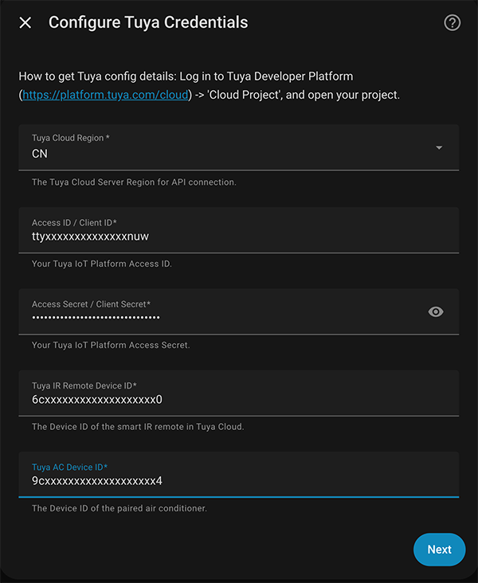
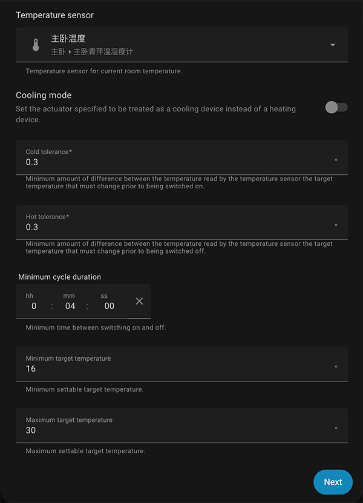
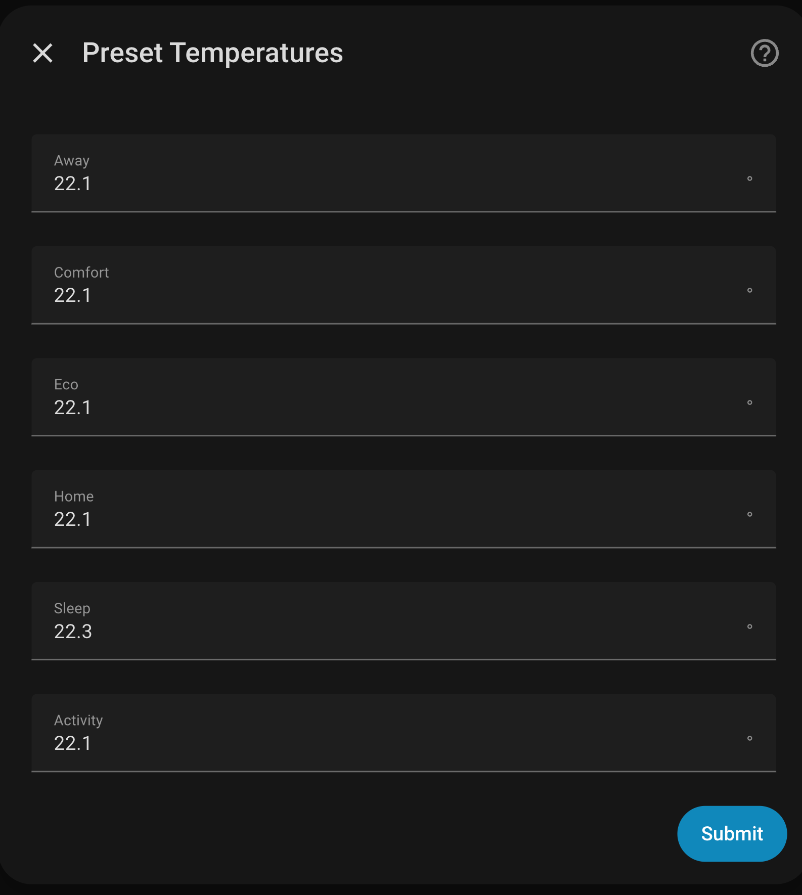
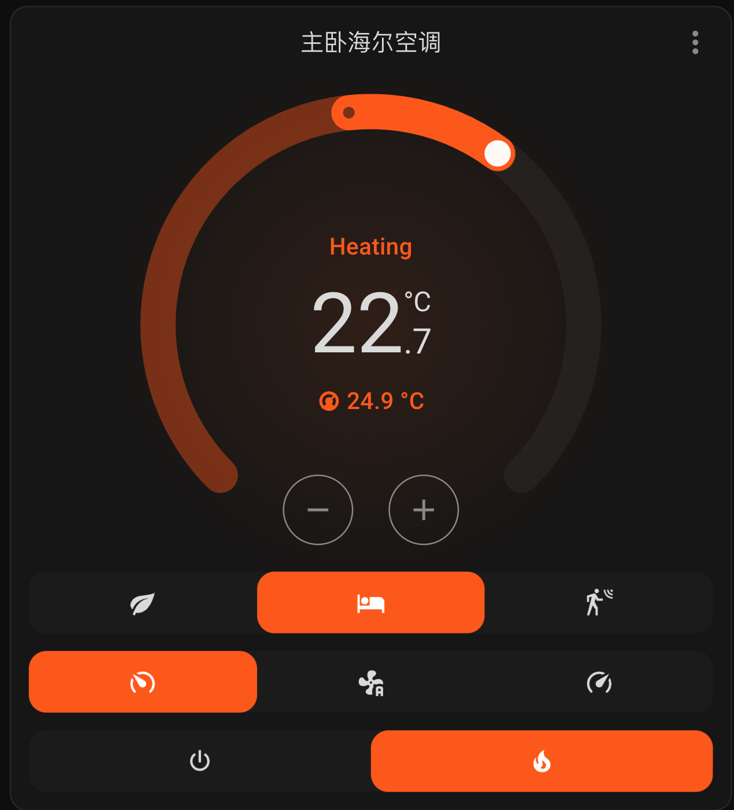
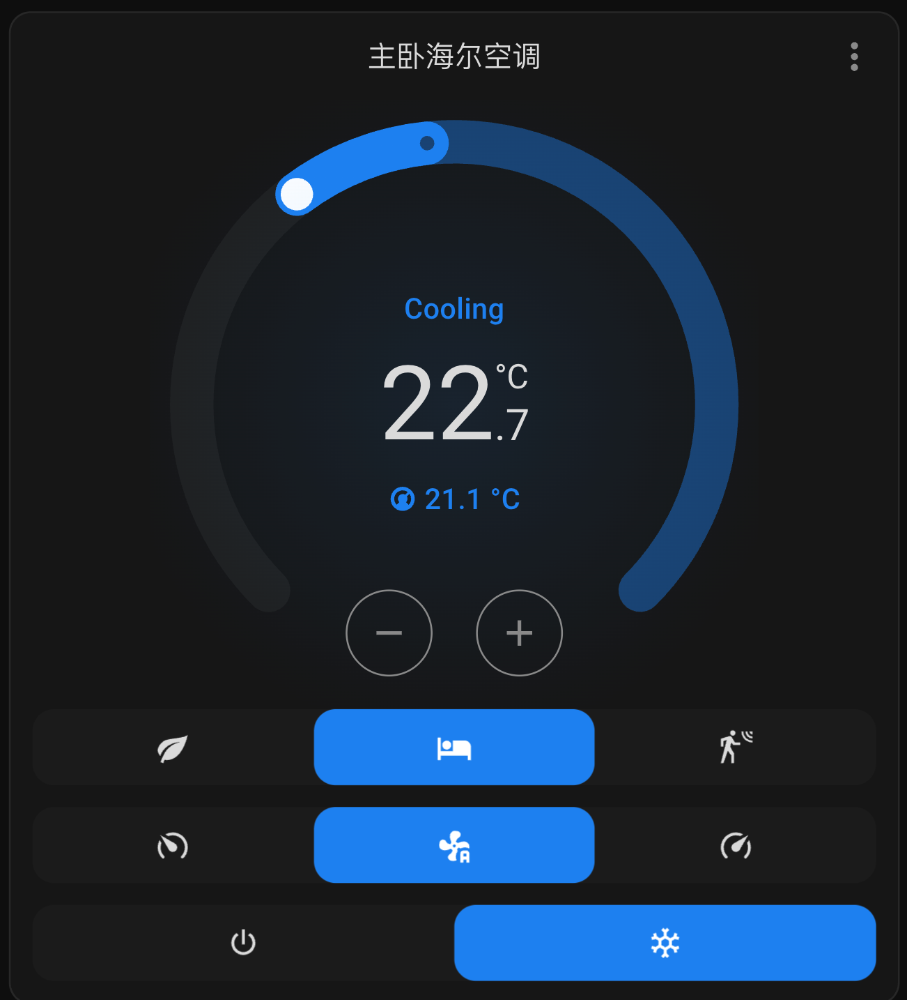
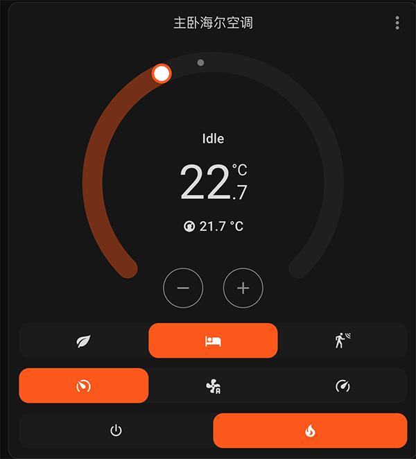
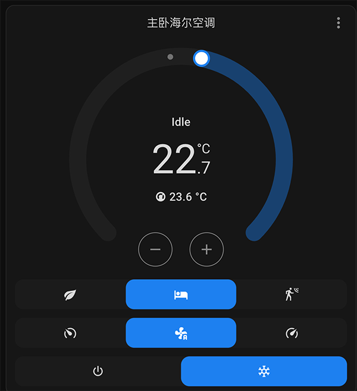

# Home Assistant Tuya IR AC Smart Integration (Generic Thermostat)

[English](#english) | [简体中文](#简体中文)

---

<h2 id="english">English</h2>

## Project Overview
This project is a customized version based on the official Home Assistant `generic_thermostat` integration. It is specifically designed for Tuya WiFi Infrared Remote Air Conditioners. By communicating with devices via Tuya OpenAPI (supporting multiple cloud regions), it achieves high-precision smart temperature control.
It not only supports basic IR remote commands but also integrates with external temperature sensors to achieve 0.1°C precision temperature control, enhancing indoor comfort via temperature difference control (0.4–0.6°C tolerance).

### Key Features
- **Multi-region Tuya Cloud Support:** Covers global regions like CN, US, EU, IN, SG, etc., backing both English and Chinese UIs.
- **External Temperature Sensor:** Can be linked with any HA temperature sensor for more accurate and comfortable control.
- **Flexible Configuration:** Supports both UI-based Config Flow and manual `configuration.yaml` setup for advanced users.
- **Complete Climate Logic:** A single HA `climate` entity handles mode switching (Cool/Heat, configured via `ac_mode`), target temperature, fan speed, auto energy-saving, and comfort modes.
- **User-Friendly Interface:** Clean, beautiful, and easy-to-use thermostat dashboard cards in HA.
- **All-Season Coverage:** Manage both summer cooling and winter heating with a single entity.
- **Smart Temperature Control Logic:** Set the AC to cool/heat mode, set target temperature and tolerances (`cold_tolerance` / `hot_tolerance`). The integration manages smart control via external sensors and Tuya OpenAPI without needing separate entities for cooling and heating.

## Installation

### Method 1: HACS Installation (Recommended)
Since this project is not yet in the default HACS repository, you need to add it as a "Custom repository".

1. Open Home Assistant and go to the **HACS** panel on the left sidebar.
2. Click the three dots menu at the top right (or the bottom of the Discover & Add section) and select **Custom repositories**.
3. Fill in the following information:
   - **Repository**: `https://github.com/jesustoachild/tuya_generic_thermostat`
   - **Category**: **Integration**
4. Click **Add**.
5. Once added, search for `Tuya Generic Thermostat` in HACS integrations.
6. Click on it and press **Download** in the bottom right corner (latest version is recommended).
7. **Crucial:** Once downloaded, you **MUST restart Home Assistant** to load the integration.

### Method 2: Manual Installation
1. Navigate to your Home Assistant configuration directory (usually `config/`) and create a `custom_components` folder if it doesn't exist.
2. Download the code from this repository and copy the entire `custom_components/tuya_generic_thermostat/` directory into your `config/custom_components/` path.
3. **Crucial:** Once copied, you **MUST restart Home Assistant** to load the integration.

---

## Configuration

After installing and **restarting Home Assistant**, you can configure the integration.

### Recommended: UI Configuration (Config Flow)
1. Go to Home Assistant -> **Settings** -> **Devices & Services**.
2. Click **Add Integration** in the bottom right corner.
3. Search for **Tuya Generic Thermostat** and select it.
4. Follow the on-screen prompts to enter your external temperature sensor, Tuya Access ID, Access Secret, and Device IDs.





### Alternative: YAML Configuration (Advanced)
```yaml
climate:
  - platform: tuya_generic_thermostat
    name: "Living Room AC"
    target_sensor: sensor.living_room_temperature
    access_id: "YOUR_ACCESS_ID"
    access_secret: "YOUR_ACCESS_SECRET"
    remote_id: "YOUR_IR_REMOTE_DEVICE_ID"
    ac_id: "YOUR_AIR_CONDITIONER_DEVICE_ID"
    region: "CN"
    ac_mode: true
    target_temp: 26
    min_temp: 16
    max_temp: 30
    target_temp_step: 1.0
    cold_tolerance: 0.5
    hot_tolerance: 0.5
    min_cycle_duration:
      minutes: 10
    away_temp: 28
    eco_temp: 27
    comfort_temp: 25
    sleep_temp: 26

logger:
  default: info
  logs:
    custom_components.tuya_generic_thermostat: debug
```

### User Interface
After successfully configuring the integration, you will see a clean and interactive thermostat card on your dashboard. Here are examples of the cooling and heating interfaces:

| Heating Mode | Cooling  Mode |
| --- | --- |
|  |  |
|  |  |
---
---

<h2 id="简体中文">简体中文</h2>

## 项目简介与功能

本项目是基于 Home Assistant 官方 `generic_thermostat` 插件的定制版本，专为 Tuya WiFi 红外遥控空调设备设计，通过 Tuya OpenAPI（支持多云区域）与设备通信，实现高精度智能温控。  
它不仅支持传统空调的基本遥控功能，还可结合外部温度传感器实现 0.1°C 精度温控，并通过温差控制（0.4–0.6°C）提升室内体感舒适度。

### 主要功能
- **多区域 Tuya 云服务器支持**：覆盖 CN / US / EU / IN / SG 等全球区域，支持中英文 UI。  
- **外部温度传感器支持**：可接入任意 HA 温度传感器，实现更精确温控与舒适体验。  
- **Home Assistant 配置支持**：同时支持 UI 配置流程（Config Flow），也可在 Home Assistant 配置目录下的 `configuration.yaml` 文件中手动添加本插件配置，方便高级用户自定义参数。  
- **完整智能温控逻辑**：通过单个 HA `climate` 实体实现模式切换（制冷/制热，可通过 `ac_mode` 配置）、温度调节、风速控制、自动节能与舒适模式等功能。  
- **界面友好直观**：HA 仪表盘上展示简洁、美观、易操作的温控控制面板。  
- **全年覆盖**：一个实体即可同时管理夏季制冷与冬季制热，无需为不同模式创建多个实体。  
- **温控逻辑说明**：设置空调为制冷或制热模式，设置室温目标的温度，和 `cold_tolerance` / `hot_tolerance` 容差。插件通过 HA `climate` 实体、外部温度传感器和 Tuya OpenAPI 完整实现智能温控控制，无需为制冷和制热创建两个实体。

## 安装方式

### 使用 HACS 安装（推荐）

由于本项目暂未收录进 HACS 的默认库中，你需要将其作为“自定义存储库 (Custom repository)”进行添加。

**具体安装步骤：**
1. 打开 Home Assistant，进入左侧边栏的 **HACS** 面板。
2. 点击右上角的三点菜单（或者直接在添加集成搜索界面），选择 **Custom repositories (自定义存储库)**。
3. 在弹出的对话框中填写以下信息：
   - **Repository (仓库地址)**: `https://github.com/jesustoachild/tuya_generic_thermostat`
   - **Category (类别)**: 选择 **Integration (集成)**
4. 点击 **Add (添加)**。
5. 添加成功后，在 HACS 的集成搜索栏中输入 `Tuya Generic Thermostat`。
6. 点击进入项目，点击右下角的 **Download (下载)**，建议选择最新版本进行安装。
7. **非常重要**：安装完成后，**必须重启 Home Assistant** 才能加载集成。

### 手动安装

1. 在 Home Assistant 主机的配置目录（通常为 `config/`）下，如果不存在则创建 `custom_components` 文件夹。
2. 下载本仓库的代码，将仓库内的 `custom_components/tuya_generic_thermostat/` 整个目录复制到你 HA 系统的 `config/custom_components/` 路径下。
3. **非常重要**：复制完成后，**必须重启 Home Assistant** 才能加载集成。

---

## 在 HA 中加载与配置

当你通过上述任意一种方式完成安装，并且**重启 Home Assistant** 后，就可以正式加载并配置使用了。

### 推荐：UI 图形化配置

1. 在 Home Assistant 主界面，进入 **配置 (Settings)** -> **设备与服务 (Devices & Services)**。
2. 点击右下角的 **添加集成 (Add Integration)**。
3. 搜索 **Tuya Generic Thermostat** 并点击添加。
4. 按照系统向导提示，填入你需要绑定的温度传感器、Tuya Access ID、Secret 和设备 ID 等信息即可完成加载。

*(此处可插入配置截图，提示：在 GitHub 网页端编辑本文件时，可直接将你的截图图片拖拽到这里即可自动上传并显示)*

### 备选：YAML 配置（高级用户）

```yaml
climate:
  - platform: tuya_generic_thermostat
    name: "客厅空调"
    target_sensor: sensor.living_room_temperature
    access_id: "YOUR_ACCESS_ID"
    access_secret: "YOUR_ACCESS_SECRET"
    remote_id: "YOUR_IR_REMOTE_DEVICE_ID"
    ac_id: "YOUR_AIR_CONDITIONER_DEVICE_ID"
    region: "CN"
    ac_mode: true
    target_temp: 26
    min_temp: 16
    max_temp: 30
    target_temp_step: 1.0
    cold_tolerance: 0.5
    hot_tolerance: 0.5
    min_cycle_duration:
      minutes: 10
    away_temp: 28
    eco_temp: 27
    comfort_temp: 25
    sleep_temp: 26

logger:
  default: info
  logs:
    custom_components.tuya_generic_thermostat: debug
```

## Credits & References / 致谢与参考

This project is built upon the foundations provided by the Home Assistant community and other open-source contributors. Special thanks to:

* **[Home Assistant Generic Thermostat](https://www.home-assistant.io/integrations/generic_thermostat/)**: The core temperature control logic is derived from the official HA integration.
* **[DavidIlie/tuya-smart-ir-ac](https://github.com/DavidIlie/tuya-smart-ir-ac)**: For the Tuya API implementation and IR AC control logic utilized in this project.
* **[Tuya Developer Platform](https://developer.tuya.com/)**: For providing the OpenAPI that makes this smart IR control possible.

## License 
This project is licensed under the **MIT License**. 
This integration is a derivative work based on the official [Home Assistant Generic Thermostat](https://github.com/home-assistant/core/tree/dev/homeassistant/components/generic_thermostat) component, which is licensed under the **Apache License 2.0**. CONTRACT, TORT OR OTHERWISE, ARISING FROM, OUT OF OR IN CONNECTION WITH THE SOFTWARE.
